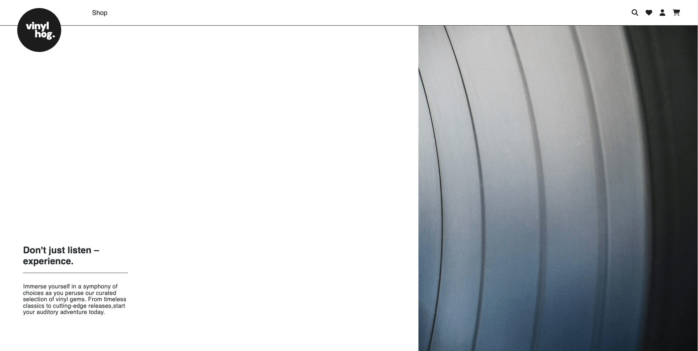

# Vinyl Hog Ecommerce Website

[Live application can be found here]()

## About
Vinyl Hog operates as a fully functional e-commerce platform built using Django, Python, Javascript, HTML, and CSS as part of The Code Institutes porfolio project 5
As a site, it allows users to browse the site, set up an account, edit account inforamtion, view previous orders and make purchaces.

## Business Goals

 The primary goal of the website is to increase sales for the business.
 This is to be achieved by:
- A design and website personality that reflects the brand values of the business and that appeals to the target demographic
- Showcase the products in a clear and organised way.
- A webiste that is easy and intutive to navigate as well as search for and filter products.
- Ability for users to register accounts and save information for future purchaces.
- By including high quality content, such as well a curated array of staff written reviews, for user engagement.
- Including SEO features in the website.

A secondary goal was to encrease engagement. This would be futher developed in the future as a hub for useres to interact wiht the review articles and build a online community and fan base.

## User Experience

### Target Audience

- 12-80 year olds.
- People interested in vinyl records and music in general. 

### User Requirements and Expectations
- A user-friendly website that balances information with an aesthetic that is appealing and modern.
- A mobile-friendly website as purchaces are often made on the go. 
- Information about the store including contact details.
- A way to book a make a purchace.
- A way to create an account.
- A way to easily access social media accounts from the website.

## User Stories

Agile  was used to keep development in line with the core requirements of the project. In Github a kanban board was created where the user stories 
were located. This made it easy to keep track of getting the essential aspects of the project covered as well as being able to see progress happening as 
the project progressed.

### General User Needs
1. As a user I can intuitively navigate through the website so that I can easily access key information and view desired content.
2. As a user I can find essential information about the company, such as: contact info, delivery info, social medial links and contact details ( all found in the footer section ).
3. As a user I can search for certain products.
4. As a user I can sort and filter products.
5. As a user I can view further details on each product such as a product description.
6. As a user I can add, remove and edit the quantity of products in my shopping basket.
7. As a user I can read staff reviews of the products.

### Non-Registered User Needs

6. As a non-registered user I can make a purchace without having to spend time creating an account.
7. As a non-registered user I can set up an account.

### Registered User Needs

7. As a registered user I can make an order.
8. As a registered user I can have my my delivery details saved which will auto fill the delivery fields in the checkout page.
9. As a registered user I can view any past orders in my profile page.
10. As a registered user I can save desired products to a personal wishlist.
11. As a registered user I can easily see if I'm logged in or not.
11. As a registered user I can change my password if forgotten.

### Admin User Needs

12. As an admin user I can access the product management page and all other pages related to the product database.
13. As an admin user I can add, edit or delete products to the store.
14. As an admin user I can add new recommendation articles and edit or delete if required.

## Scope
The website has to achieve the essential user & business goals. The following features will be included in this version:

- Visual language and styling that reflects the brands values and appeals to the target audience.
- A fully responsive website.
- A  navbar that will have links to: the product pages, account features, a product search function, link to users wishlist and link to the users basket. 
- A  home page that includes: a visually strong landing page that entices the user to further exploration of the business, a new releases section and recommendation articles section.
- A footer section with delivery information, business information, returns iformation,  social media links and contact details. 

- About section with a brief suitable description of the restaurant with three images. ****************

- Products page where users can view the albums available.
- Product page where the customers can view the product in further detail and have the option to add it to their basket, or if logged in their wishlist.
- A basket page where the customer can view the products in their basket and remove and change quantity if necessary. 
- A checkout page where the customer can make a purchace.
 

- Register and login pages using Django Allauth.
- A user profile page to view order history and default delivery information.
- A logout page for logged in users.

- A product, artist and genre management page for admin users.
- Product add, edit and delete pages for admin users.

## Front-End Design

### Brief
- A clean, modern and minimal design in monochrome which communicates the brand values.
- The website personality and tone to be quite neutral.
- Must appeal to the target audience visually and in tone/personslity.
- A wwbsite that is easy to navigate and locate necessary information for optimal user expeerience and to ensure ease of making purchaces.

### Images

- Each product card includes the cover of each album, or if not available a default image of a blank record.
- Recommendation articles also have a suitable image of the band or relevant album.

### Landing Page
- A visually enticing landing page urging a potential customer to explore the website further and find out more.
- Monochrome and subduded it was important the landing page was in line with the overall design brief of the wepage.
- The decision to leave out a CTA button was made to preserve the tone and personality of the landing page. 

### Colours
#### Background Colours
- The website uses a light theme throughout. This works well in creating a clean, modern and refined feel to the content as well as enhancing readability.
- For the products grid display and the product page a light grey is used as a background colour. 

#### Styling Colours
****************************************

### Fonts
- Google fonts DM Sans is used on the brand logo. This sans-serif font has works well in a bold and lowercase configuration as its fullness reflects and compliments the black cirlce it is enclosed in.  

- Helvetica is used on all other text. It offers a clean, refined and legible design, which makes it easy to read on screens of different sizes and resolutions. It has a neutral appearance and doesn't have any distracting features that can make it difficult to read. It is also in line with the refined minimal aesthetic of the website.

## Back-End Design

### User Model
- User model as part of the Django Allauth library contains basic information about the authenticated user and contains the folowing fields: username, password and email.
     
### Artist Model

- This model was created to add an artist for the products. It is connected to Album model with a ForeignKey

### Genre Model

- This custom model holds all the genres. 
- It has a ManyToMany relationship woth the Album model, allowing for more than one genre per album.

### Album Model

- This custom model holds all the albums.
- This includes the a description of the album and a featured image. 
Book This is a custom product model. It is connected to Genre as a ManyToManyField and author as ForeignField. In addition to that it has fields for handling stock. The Stock field holds the integer value of the stock levels; this is updated when a product is purchased. 

### WishlistItem Model

- This model contains the product field which is connected to the Album model as a ForeignField. 
- It also contains a user which will assign the logged-in user from the Allauth User model and assign them to the created instance.

### RecommendationPost Model

- This model holds the recommendation articles. This are submitted by admin users.
- It contains three foreign fields: author, product and user. 

### Author Model

- This model contains a user as a foreign field and takes from the Allauth User Model.
- The author_name will be the displayed name.

## Features

### Header and Navigation

 

### Landing Page

 

### New Releases Section

 As one scrolls down the home page we have the "New Releases" section. It displays the most recently added products.

 

### Recommendation Section

 
This section displays the latest four recommendation posts added. These are written by staff of the company and act as high quality content to serve the customer and further engagement.

### Footer Section

 

### Account Pages

 

 
  
   
    

### Products Page

 

 

 

### Product Page

 

 
SEO Features:

 
 
  

### Basket

 

 

### Checkout

 

### Order Confirmation/Details

 

 

### User Profile

 

 

### Wishlist

 

 

### Product Management Pages

 

 
 
 

## Search Engine Optimization SEO and Marketing

### Business Model

### SEO
- A keyword list for long and short-tail keywords was made and the refined using [wordtracker](https://www.wordtracker.com/).
- Descriptive meta tags were added to the base.html template, including title, description and keywords.
- Semantic HTLM elements were implemented.
- The use of keywords in section headings when suitable.
- Further meta tags were added to the product pages  and article posts depending on the shown product or article. These included the product name and releated artist in the description and keywords.
- For the product and article post images the relevant product name and artist is contained in the image alternative dwscription.
- A sitemap was generated using [xml-sitemaps](https://www.xml-sitemaps.com/) This was generated using the deployed website. The file is included in the root level of the project.
- Robots.txt file was created at the root level of the project. This file tells the search engine crawlers which URLs they can access on the website.

### Marketing
- Newsletter is included in the home page. This section facilitates user engagement and promotes the e-commerce store through effective email marketing and social media presence.

## Manual Testing of User Stories

<mark>WAS = Works as expected</mark>

### 1. General User Needs

**Goal** | **Step** | **Expected Result** | **Actual Result**
------------ | ------------ | ------------ | ------------ |
Intuitively navigate through the website | Test all links in the header and all website pages| links open desired page | WAS |
Find essential information about the company |  Test links in the footer secion | Content of the page is presented | WAS |
Search for certain products | Enter search words in search box and press enter | Releated products are shown in products page | WAS |
Sort and filter products | On products page test the sort functionality and catagories | Releated products are shown in products page | WAS |
View further details on each product | Click on the product card on the homepage and products page | Releated product is shown on product page | WAS |
Add, remove and edit the quantity of products in my shopping basket | Add product to basket on product page. On Basket page delete product and edit quantity. | Product added to basket. Product quantity updated. Product deleted. Success messages displayed. | WAS |
Access review articles | From the home page click on a review card. | Taken to review page. Review article shown | WAS |

### 2. Non-Registered User Needs

**Goal** | **Step** | **Expected Result** | **Actual Result**
------------ | ------------ | ------------ | ------------ |
Set up an account | From the account dropdown in the header, user navigates to the sign up page and enters their username and password | Account is set up. Success message displayed | WAS |
Make a purchace | Make a purchace on checkout page. | Order confirmation page displayed. Confirmation sent to users email. | WAS |

### 3. Registered User Needs

**Goal** | **Step** | **Expected Result** | **Actual Result**
------------ | ------------ | ------------ | ------------ |
Sing In/Out | User navigates to the sign in/sign out page and enters their username and password/signs out. | Sign in/Sign out. Success message displayed | WAS |

Make a purchace | Make a purchace on checkout page. | Order confirmation page displayed. Confirmation sent to users email. | WAS |
Add/Update delivery details | Add/Update delivery details on user profile page | Success message displayed. Delivery updates shown on profile page and check out page. | WAS |

Make a purchace | Make a purchace on checkout page. | Order confirmation page displayed. Confirmation sent to users email. Order displayed on profile page order history table. | WAS |
View any past orders| Navigate to profile page. | Orders displayed in order history table. When clicked on opens up the specific order in Order details page. | WAS |
Save/Remove products in wishlist | On product page add product to wishlist. On wishlist page remove product. | When added/removed success message displayed and product is added/removed form wishlist. | WAS |
See if logged in or not| Click on account dropdown. | If logged in then "sign out" link is shown. If logged out then "sign in" link is shown | WAS |

### Registered User Needs

7. As a registered user I can make an order.
8. As a registered user I can have my my delivery details saved which will auto fill the delivery fields in the checkout page.
9. As a registered user I can view any past orders in my profile page.
10. As a registered user I can save desired products to a personal wishlist.
11. As a registered user I can easily see if I'm logged in or not.

### 3. As a d user I can add, remove and update quantity in .

**Step** | **Expected Result** | **Actual Result**
------------ | ------------ | ------------ |
Navigating to :https://.herokuapp.com/ | home page loads | WAS |
Click on reservation link in the nav-bar | Site navigates to reservation section | WAS |
Submit form with missing form fields | Prompt is shown to fill in field | WAS |
Use past date in date field | Error message shown | WAS |
Fill in all fields with valid date| Success message displayed. Instance saved in model | WAS |
Fill in form fields on date/time fully booked | Unsuccessfull message displayed | WAS |
Fill in form fields on date/time with no suitable table available | Unsuccessfull message displayed | WAS |

### 3. As a non-registered user I can make a booking so that I don't need to spend time setting up an account.

**Step** | **Expected Result** | **Actual Result**
------------ | ------------ | ------------ |
Navigating to :https://.herokuapp.com/ | home page loads | WAS |
Click on reservation link in the nav-bar | Site navigates to reservation section | WAS |
Submit form with missing form fields | Prompt is shown to fill in field | WAS |
Use past date in date field | Error message shown | WAS |
Fill in all fields with valid date| Success message displayed. Instance saved in model | WAS |
Fill in form fields on date/time fully booked | Unsuccessfull message displayed | WAS |
Fill in form fields on date/time with no suitable table available | Unsuccessfull message displayed | WAS |

## Technologies Used

- [Django](https://www.djangoproject.com/)
    - Django is the framework that has been used to build the over project and its apps.
- [Python](https://www.python.org/)
    - Python is the core programming language used to write all of the code in this application to make it fully functional.
- [Bootstrap](https://getbootstrap.com/)
    - Used for creating responsive design.
- [Google Fonts](https://fonts.google.com/)
    - Used to obtain the fonts linked in the header, fonts used were Raleway and Lobster
- [Font Awesome](https://fontawesome.com/)
    - Used to obtain the icons used on the high scores and rules pages.
- [Google Developer Tools](https://developers.google.com/web/tools/chrome-devtools)
    - Used as a primary method of fixing spacing issues, finding bugs, and testing responsiveness across the project.
- [GitHub](https://github.com/)
    - Used to store code for the project after being pushed.
- [Git](https://git-scm.com/)
    - Used for version control by utilising the Gitpod terminal to commit to Git and Push to GitHub.
- [Gitpod](https://www.gitpod.io/)
    - Used as the development environment.
- [Heroku](https://dashboard.heroku.com/apps)
    - Used to deploy my application.
- [Lucid](https://lucid.app/documents#/dashboard)
    - Used to create the ERD for the project.
- [Grammarly](https://www.grammarly.com/)
    - Used to fix the thousands of grammar errors across the project.
- [ImageResizer](https://imageresizer.com/)
    - Used to resize images to reduce loading time.
- [Code Institute Python Linter](https://pep8ci.herokuapp.com/)
    - Used to test my code for any issues or errors.
- [Grammarly](https://www.grammarly.com/)
    - Used to fix the grammar errors across the project.
- [Coloors](https://coolors.co/)
    - Used to create a colour palette for the design.
- [Cloudinary](https://cloudinary.com/)
    - Used to store all of my static files and images.
    - [Favicon.io](https://favicon.io/)
    - Used to create favicon's for my website
- [W3C Markup Validation Service](https://validator.w3.org/) 
    - Used to validate all HTML code written and used in this webpage.
- [W3C CSS Validation Service](https://jigsaw.w3.org/css-validator/#validate_by_input)
    - Used to validate all CSS code written and used in this webpage.
- [JSHint](https://jshint.com/)
    - Used to validate JS code
- [Freeformatter CSS Beautify](https://www.freeformatter.com/css-beautifier.html)
    - Used to accurately format my CSS code.
- [Freeformatter HTML Formatter](https://www.freeformatter.com/html-formatter.html)
    - Used to accurately format my HTML code.
- [AmIResponsive](http://ami.responsivedesign.is/)
    - Used to generate responsive image used in README file.
- [SQLite](https://www.sqlite.org/index.html)
    - I have SQLite to run my database tests locally.
- [PostgreSQL](https://www.postgresql.org/)
    - I have used Heroku's PostgreSQL relational database in deployment to store the data for my models.
