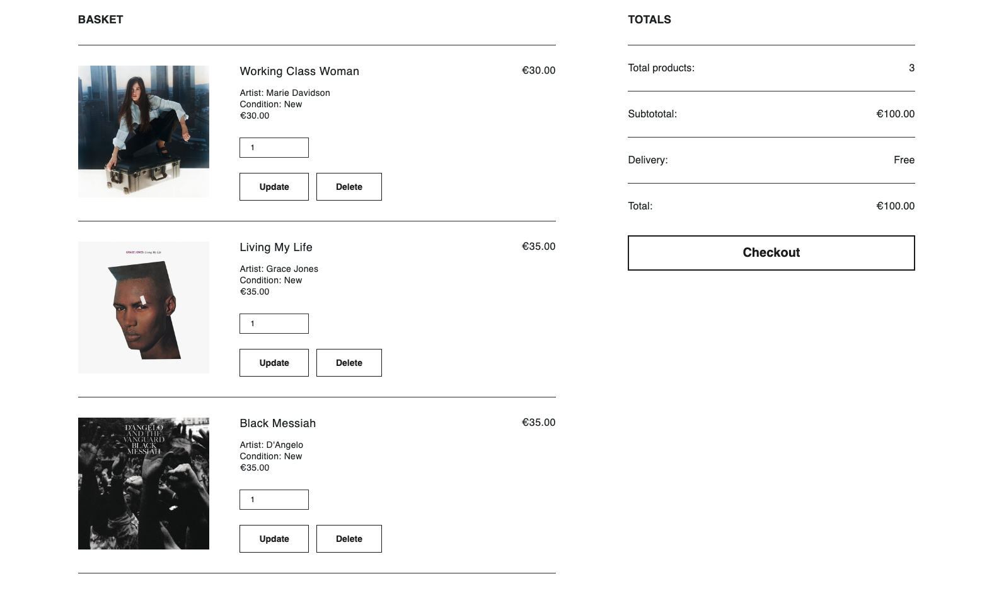
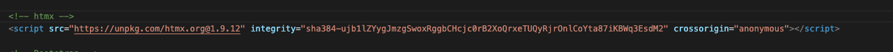

# Vinyl Hog Ecommerce Website

[Live application can be found here]()

## About
Vinyl Hog operates as a fully functional e-commerce platform built using Django, Python, Javascript, HTML, and CSS as part of The Code Institutes porfolio project 5
As a site, it allows users to browse the site, set up an account, edit account inforamtion, view previous orders and make purchaces.

## Scope

### Business Goals

 The primary goal of the website is to increase sales for the business.
 This is to be achieved by:
- A design and website personality that reflects the brand values of the business and that appeals to the target demographic
- Showcase the products in a clear and organised way.
- A webiste that is easy and intutive to navigate as well as search for and filter products.
- Ability for users to register accounts and save information for future purchaces.
- By including high quality content, such as well a curated array of staff written reviews, for user engagement.
- Including SEO features in the website.

A secondary goal was to encrease engagement. This would be futher developed in the future as a hub for useres to interact wiht the review articles and build a online community and fan base.

### Target Audience

- 12-80 year olds.
- People interested in vinyl records and music in general. 

### User Experience - Requirements and Expectations
- A user-friendly website that balances information with an aesthetic that is appealing and modern.
- A mobile-friendly website as purchaces are often made on the go. 
- Information about the store including contact details.
- A way to book a make a purchace.
- A way to create an account.
- A way to easily access social media accounts from the website.

## Development - Agile Methodology

Agile  was used to keep development in line with the core requirements of the project. In Figma a kanban board was created where the user stories 
were located. This made it easy to keep track of getting the essential aspects of the project covered as well as being able to see progress happening as 
the project progressed.

### General User Needs
1. As a user I can intuitively navigate through the website so that I can easily access key information and view desired content.
2. As a user I can find essential information about the company, such as: contact info, delivery info, social medial links and contact details ( all found in the footer section ).
2. As a user I can view the products clearly.
3. As a user I can search for certain products.
4. As a user I can sort and filter products.
5. As a user I can view further details on each product such as a product description.
6. As a user I can add, remove and edit the quantity of products in my shopping basket.
7. As a user I can read staff reviews of the products.

### Non-Registered User Needs

6. As a non-registered user I can make a purchase without having to spend time creating an account.
7. As a non-registered user I can set up an account.

### Registered User Needs

7. As a registered user I can make an order.
8. As a registered user I can have my my delivery details saved which will auto fill the delivery fields in the checkout page.
9. As a registered user I can view any past orders in my profile page.
10. As a registered user I can save desired products to a personal wishlist.
11. As a registered user I can easily see if I'm logged in or not.
11. As a registeded user I can log in/out of my account.
11. As a registered user I can change my password if forgotten.

### Admin User Needs

12. As an admin user I can access the product management page and all other pages related to the product database.
13. As an admin user I can add, edit or delete products to the store.
14. As an admin user I can add new recommendation articles and edit or delete if required.

 

## Front-End Design

### Brief
- A clean, modern and minimal design which communicates the brand values.
- The website personality and tone to be quite neutral.
- Must appeal to the target audience visually and in tone/personslity.
- A website that is easy to navigate and locate necessary information for optimal user expeerience and to ensure ease of making purchaces.

### Images

- Each product card includes the cover of each album, or if not available a default image of a blank record.
- Recommendation articles also have a suitable image of the band or relevant album.

### Landing Page
- A visually enticing landing page urging a potential customer to explore the website further and find out more.
- Monochrome and subduded it was important the landing page was in line with the overall design brief of the wepage.
- The decision to leave out a CTA button was made to preserve the tone and personality of the landing page. 

### Colours
#### Primary Colours & Background Colours
- The website is monochrome thoroughout to fulfill the design brief. This offers a clean, refined and modern feel to the website as well as offering easy readability.
- Pure white (#FFFFFF) is utilized as the main background colour.
- An off black (#1E1C1C) is used for fonts and the footer. Softer than pure black it helps readibility.
- For the products card display and the indivual product page, a light grey (#EFF2F3) is used as a background colour. 
- A colour gradient chart was used to generate shades between the two primary colours. These werer used for hover and background colours. 

#### Styling Colours

### Fonts
- Google fonts DM Sans is used on the brand logo. This sans-serif font has works well in a bold and lowercase configuration as its fullness reflects and compliments the black cirlce it is enclosed in.

- Helvetica is used on all other text. It offers a clean, refined and legible design, which makes it easy to read on screens of different sizes and resolutions. It has a neutral appearance and doesn't have any distracting features that can make it difficult to read. It is also in line with the refined minimal aesthetic of the website.

## Back-End Design

### User Model
The User model, as part of the Django Allauth library, contains basic information about the authenticated user and contains the folowing fields: username, password and email.

### UserProfile Model
The UserProfile model is a custom custom-created model to handle the user profile details when making a order.

### Artist Model
This model was created to add an artist for the products. It is connected to Album model with a ForeignKey

### Genre Model
This custom model holds all the genres. 
It has a ManyToMany relationship woth the Album model, allowing for more than one genre per album.

### Condition Model
This model was created to add a condition for the products ("new" or "used"). It is connected to Album model with a ForeignKey

### Album Model
This custom model holds all the albums.
This includes the a description of the album and a featured image. 
It is connected to Genre as a ManyToManyField and author as ForeignField. In addition to that it has a field for handling stock. The Stock field holds the integer value of the stock levels; this is updated when a product is purchased. 
It also had an "on_sale" boolean field as well as an "on_sale_price" integer filed. 

### WishlistItem Model
This model contains the product field which is connected to the Album model as a ForeignField. 
It also contains a user which will assign the logged-in user from the Allauth User model and assign them to the created instance.

### RecommendationPost Model
This model holds the recommendation articles. This are submitted by admin users.
It contains two foreign fields: product and user, signifing the related product and storing the admin user who uploaded the post.

### Order Model
The Order model holds all user order information and has a ForeignKey relationship with the UserProfile model.

### OrderLineItem Model
This model is linked to the Order and Book models via ForeignKey and is created for each item in an order.

  

 [A database schema was also created with with DjangoViz and can be found here](https://gh.atlasgo.cloud/explore/f13973b1)

## Features

### Header and Navigation

 

### Landing Page

 

### New Releases Section

 As one scrolls down the home page we have the "New Releases" section. It displays the most recently added products.

 

### Recommendation Section

 
This section displays the latest four recommendation posts added. These are written by staff of the company and act as high quality content to serve the customer and further engagement.

### Footer Section

 

### Account Pages

 

 
  
   
    

### Products Page

 

 

 

### Product Page

 

 
SEO Features:

 
 
  

### Basket

 

 

### Checkout

 

### Order Confirmation/Details

 

 

### User Profile

 

 

### Wishlist

 

 

### Article Post

 

 
 

### Product Management Pages

 

 
 
 

### 404 Error Page

 

 A custom 404 page was implemented to handle and site errors.
  

 

## Search Engine Optimization SEO and Marketing

### SEO

#### Keywords
 A keyword list for long and short-tail keywords was made and the refined using [wordtracker](https://www.wordtracker.com/).
 

 

#### HTML
Descriptive meta tags were added to the base.html template, including title, description and keywords. Also, there is a content block for additional tags.

 
Further meta tags were added to the product pages & blog posts depending on the shown product or article. These included the product name and releated artist in the description and keywords.

 

For the product image and article post images the relevant product name and artist is contained in the image alternative description.

 
Also implemented were:
- Semantic HTLM elements were implemented through out the site.
- The use of keywords in section headings when suitable.
- The addition of high quality content used in the site. This includes the product descriptions and especially the reviews.
- A sitemap was generated using [xml-sitemaps](https://www.xml-sitemaps.com/) This was generated using the deployed website. The file is included in the root level of the project.
- Robots.txt file was created at the root level of the project. This file tells the search engine crawlers which URLs they can access on the website.

### Marketing
A newsletter signup form is included in the footer section. This facilitates user engagement and promotes the e-commerce store through effective email marketing and social media presence.
 

Facebook Page
 

## Manual Testing of User Stories

<mark>WAS = Works as expected</mark>

### 1. General User Needs

**Goal** | **Step** | **Expected Result** | **Actual Result**
------------ | ------------ | ------------ | ------------ |
Intuitively navigate through the website | Test all links in the header and all website pages. | Links open desired page | WAS |
Find essential information about the company |  Test links in the footer secion | Content of the page is presented | WAS |
Search for certain products | Enter search words in search box and press enter | Releated products are shown in products page | WAS |
Sort and filter products | On products page test the sort functionality and catagories | Releated products are shown in products page | WAS |
View further details on each product | Click on the product card on the homepage and products page | Releated product is shown on product page | WAS |
Add, remove and edit the quantity of products in my shopping basket | Add product to basket on product page. On Basket page delete product and edit quantity. | Product added to basket. Product quantity updated. Product deleted. Success messages displayed. | WAS |
Access review articles | From the home page click on a review card. | Taken to review page. Review article shown. | WAS |

### 2. Non-Registered User Needs

**Goal** | **Step** | **Expected Result** | **Actual Result**
------------ | ------------ | ------------ | ------------ |
Set up an account | From the account dropdown in the header, user navigates to the sign up page and enters their username and password. User logs in. | Account is set up. Success message displayed whn set up and logging in. | WAS |
Make a purchace | Make a purchace on checkout page. | Success message show. Order confirmation page displayed. Confirmation sent to users email. | WAS |

### 3. Registered User Needs

**Goal** | **Step** | **Expected Result** | **Actual Result**
------------ | ------------ | ------------ | ------------ |
Sing In/Out | User navigates to the sign in/sign out page and enters their username and password. | Sign in/Sign out of account. Success message displayed | WAS |
Make a purchace | Make a purchace on checkout page. | Order confirmation page displayed. Confirmation sent to users email. | WAS |
Add/Update delivery details | Add/Update delivery details on user profile page | Success message displayed. Delivery updates shown on profile page and check out page. | WAS |
Make a purchace | Make a purchace on checkout page. | Order confirmation page displayed. Confirmation sent to users email. Order displayed on profile page order history table. | WAS |
View any past orders| Navigate to profile page. | Orders displayed in order history table. When clicked on opens up the specific order in Order details page. | WAS |
Save/Remove products in wishlist | On product page add product to wishlist. On wishlist page remove product. | When added/removed success message displayed and product is added/removed form wishlist. | WAS |
See if logged in or not| Click on account dropdown. | If logged in then "sign out" link is shown. If logged out then "sign in" link is shown | WAS |

### 3. Admin User Needs

**Goal** | **Step** | **Expected Result** | **Actual Result**
------------ | ------------ | ------------ | ------------ |
Access the product management page | Admin user signs in then clicks on the account link in the nav-bar, product management link should be shown. | Opens the product managemnet page. | WAS |
Access the blog management page | Admin user signs in, clicks on the account link in the nav-bar, blog management link is shown and clicked on. | Opens the blog managemnet page. | WAS |
Add product/artist/genre | On approiate management page the user clicks on the add button to open the add product/artist/genre page. Form is filled in. | Success message displayed. User returned to the management page and new product/artist/genre shown in the relevant database table. New product is shown on the sites products page.  | WAS |
Edit product/artist/genre | On approiate management page the user clicks on the edit button on desired instance. Taken to edit page. Form is editeded. | Success message displayed. User returned to the management page and edited product/artist/genre shown in the list. Changes are shown. Changes are shown on the sites products page.| WAS |
Delete product/artist/genre | On the management page the user clicks on the delete button on desired instance. Taken to delete page. Confirmation button is clicked. | Success message displayed. User returned to management page and deleted product/artist/genre removed from the list. | WAS |
Access the blog management page | Admin user signs in, clicks on the account link in the nav-bar, blog management link is shown and clicked on. | Opens the blog managemnet page. | WAS |
Add review article | On blog management page the user clicks on the add button to open the add post page. Form is filled in. | Success message displayed. User returned to the management page and new blog article shown in the database table. New article is shown on the sites  page.  | WAS |
Edit review article | OOn blog management page the user clicks on the edit button on desired instance. Taken to edit page. Form is editeded. | Success message displayed. User returned to the management page and edited article shown in the list. Changes are shown. Changes are shown on the sites page.| WAS |
Delete review article  | On the management page the user clicks on the delete button on desired instance. Taken to delete page. Confirmation button is clicked. | Success message displayed. User returned to management page and deleted article removed from the list. | WAS |

## Bugs and Fixes

### Issue with hitting back on the browser and page reload

One bug I had was with the initial way I added a product to the basket or wishlist. 
Adding an item to the basket  was done in the basket app views.py using the function “add_basket”. 
The url that initiated this view was “add-basket” and was fired as the action when the add basket form was submitted on the product.html template. 
The problem was once the function was called it redirected to itself. This worked well but if a person hit back on the browser, which is very common on a product page on an ecommerce website,  it would reload the initial product page again, that is,  stay on the same page and redisp;ay any messages. Even worse, if the person had added two separate quantities to the basket it would take the same amount of back clicks to return to the products page. 

This was solved by:
- Removing the “add-basket” url from the form, leaving the action empty.
- Calling the “add_basket” view in the “product” view from products.py in the products app. The same was done for adding an item to the wishlist.
- Extra logic was added in the product view to identify which form had been submitted, the “add_wishlist_item” or “add_basket”. This was done by adding a hidden form input called "form_type" with the value of basket or wishlist.
- Additionally, this entailed changing the product_id to string format in  the add_basket view, as it didn’t work as an integer. 
- Using HTMX script to stop the page refreshing once form was submitted.
- A final issue was that the HTMX script interfered with the dropdown menus in the header. This was solved by moving the bootstrap scripts to the header section. 

The same format was followed for the views in the basket app which deal with updating the item quantity and deleting the item.

 

Initial form and product view 

 

New form and product view 

 

HTMX script in base.html 

 

 

### Issue with toast messages not closing 

Another bug was that the toast messages did not close if one clicked on a navigation links or search bar, therefore  the message blocking the nav link dropdowns. This was solved by adding some custom JS. 

 

## Technologies Used

### Development 

- [Django](https://www.djangoproject.com/)
    - Django is the framework that has been used to build the over project and its apps.
- [Python](https://www.python.org/)
    - Python is the core programming language used to write all of the code in this application to make it fully functional.
- [Bootstrap](https://getbootstrap.com/)
    - Used for creating responsive design elements.

- [Google Developer Tools](https://developers.google.com/web/tools/chrome-devtools)
    - Used as a primary method of fixing spacing issues, finding bugs, and testing responsiveness across the project.
- [GitHub](https://github.com/)
    - Used to store code for the project after being pushed.
- [Git](https://git-scm.com/)
    - Used for version control by utilising the Gitpod terminal to commit to Git and Push to GitHub.
- [Gitpod](https://www.gitpod.io/)
    - Used as the development environment.
- [Heroku](https://dashboard.heroku.com/apps)
    - Used to deploy the live application.
- [Cloudinary](https://cloudinary.com/)
    - Used to store all of the static files and images.

- [SQLite](https://www.sqlite.org/index.html)
    - I have SQLite to run my database tests locally.
- [PostgreSQL](https://www.postgresql.org/)
    - I have used Heroku's PostgreSQL relational database in deployment to store the data for my models.

 

### Design/Content Tools
- [Google Fonts](https://fonts.google.com/)
    - Used to obtain the fonts used.
- [Font Awesome](https://fontawesome.com/)
    - Used to obtain the icons used.

- [Figma](https://https://www.figma.com)
    - Used to create the user stories kanban.
- [Db Diagram](https://dbdiagram.io/)
    - Used to create the database diagram.
    

- [Chat GPT](https://chatgpt.com/)
    - Used to generate the product descriptions and blog reviews.
- [ImageResizer](https://imageresizer.com/)
    - Used to resize images to reduce loading time.

- [Coloors](https://coolors.co/)
    - Used to create a colour palette and colour gradient chart.

- [Favicon.io](https://favicon.io/)
    - Used to create favicon's for the website.

 

### Formatting/Testing

- [Code Institute Python Linter](https://pep8ci.herokuapp.com/)
    - Used to test the code for any issues or errors.
- [W3C Markup Validation Service](https://validator.w3.org/) 
    - Used to validate all HTML code written and used in this webpage.
- [W3C CSS Validation Service](https://jigsaw.w3.org/css-validator/#validate_by_input)
    - Used to validate all CSS code written and used in this webpage.
- [JSHint](https://jshint.com/)
    - Used to validate JS code
- [Freeformatter CSS Beautify](https://www.freeformatter.com/css-beautifier.html)
    - Used to accurately format my CSS code.

- [Freeformatter HTML Formatter](https://www.freeformatter.com/html-formatter.html)
    - Used to accurately format my HTML code.

- [AmIResponsive](http://ami.responsivedesign.is/)
    - Used to generate responsive image used in README file.

## Scope
The website has to achieve the essential user & business goals. The following features will be included in this version:

- Visual language and styling that reflects the brands values and appeals to the target audience.
- A fully responsive website.
- A navbar that will have links to: the product pages, account features, a product search function, link to users wishlist and link to the users basket. 
- A home page that includes: a visually strong landing page that entices the user to further exploration of the business, a new releases section and recommendation articles section.
- A footer section with delivery information, business information, returns iformation,  social media links and contact details. 

- About section with a brief suitable description of the restaurant with three images. ****************

- Products page where users can view the albums available.
- Product page where the customers can view the product in further detail and have the option to add it to their basket, or if logged in their wishlist.
- A basket page where the customer can view the products in their basket and remove and change quantity if necessary. 
- A checkout page where the customer can make a purchace.
 

- Register and login pages using Django Allauth.
- A user profile page to view order history and default delivery information.
- A logout page for logged in users.

- A product, artist and genre management page for admin users.
- Product add, edit and delete pages for admin users.