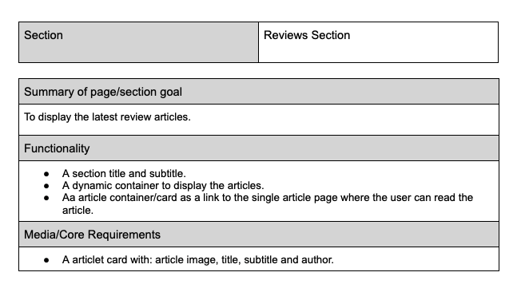
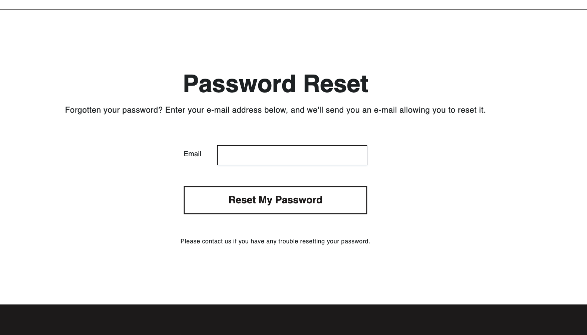
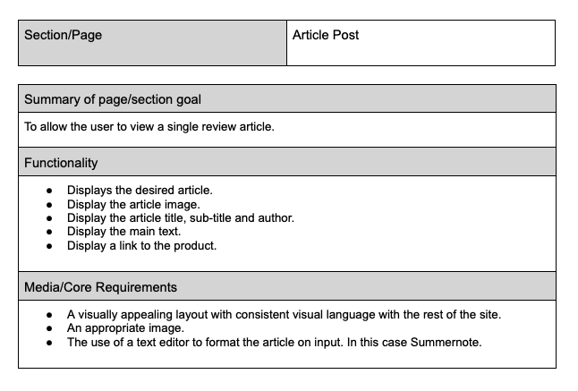
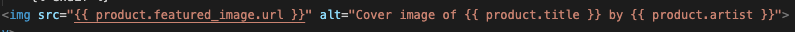

# Vinyl Hog Ecommerce Website

[Live application can be found here](https://vinyl-hog-db2fc2977a10.herokuapp.com/)

## About
Vinyl Hog operates as a fully functional e-commerce platform built using Django, Stripe, Python, JavaScript, HTML, and CSS as part of The Code Institute's portfolio project 5. As a site, it allows users to browse the site, set up an account, edit account information, view previous orders, and make purchases.

## Scope

### Business Goals

 The primary goal of the website is to increase sales for the business. This is to be achieved by:

- A design and website personality that reflects the brand values of the business and appeals to the target demographic.
- Showcasing the products in a clear and organized way.
- A website that is easy and intuitive to navigate, as well as search for and filter products.
- The ability for users to register accounts and save information for future purchases.
- Including high-quality content, such as a well-curated array of staff-written reviews, for user engagement.
- Incorporating SEO features into the website.

A secondary goal is to increase engagement and build a community. This would be further developed in the future as a hub for users to interact with the review articles and build an online community and fan base.

### Target Audience

- 12-80 year olds.
- People interested in vinyl records and music in general.
- Pepple interested in curated music collections, niche artists and detailed album reviews.  

### User Experience - Requirements and Expectations
- A user-friendly website that balances information with an aesthetic that is appealing and modern.
- A mobile-friendly website as purchases are often made on the go.
- Information about the store, including contact details.
- A way to make a purchase.
- A way to create an account.
- A way to easily access social media accounts from the website.

## Development - Agile Methodology

Agile was used to keep development in line with the core requirements of the project. In Figma, a kanban board was created where the user stories were located. This made it easy to keep track of getting the essential aspects of the project covered as well as being able to see progress happening as the project progressed.

### General User Needs
1. As a user, I can intuitively navigate through the website so that I can easily access key information and view desired content.
2. As a user, I can find essential information about the company, such as: contact info, delivery info, social media links, and contact details (all found in the footer section).
3. As a user, I can view the products clearly.
4. As a user, I can search for certain products.
5. As a user, I can sort and filter products.
6. As a user, I can view further details on each product, such as a product description.
7. As a user, I can add, remove, and edit the quantity of products in my shopping basket.
8. As a user, I can read staff reviews of the products.

### Non-Registered User Needs

1. As a non-registered user, I can make a purchase without having to spend time creating an account.
2. As a non-registered user, I can set up an account.

### Registered User Needs

1. As a registered user, I can make an order.
2. As a registered user, I can have my delivery details saved which will auto-fill the delivery fields on the checkout page.
3. As a registered user, I can view any past orders on my profile page.
4. As a registered user, I can save desired products to a personal wishlist.
5. As a registered user, I can easily see if I'm logged in or not.
6. As a registered user, I can log in/out of my account.
7. As a registered user, I can change my password if forgotten.

### Admin User Needs

1. As an admin user, I can access the product management page and all other pages related to the product database.
2. As an admin user, I can add, edit, or delete products from the store.
3. As an admin user, I can add new recommendation articles and edit or delete them if required.

 

## Front-End Design

### Brief
- A clean, modern, and minimal design that communicates the brand values.
- The website personality and tone to be quite neutral.
- Must appeal to the target audience visually and in tone/personality.
- A website that is easy to navigate and locate necessary information for optimal user experience and to ensure ease of making purchases.

### Images

- Each product card includes the cover of each album, or if not available, a default image of a blank record.
- Recommendation articles also have a suitable image of the band or relevant album.

### Landing Page
- A visually enticing landing page urging a potential customer to explore the website further and find out more.
- Monochrome and subdued, it was important the landing page was in line with the overall design brief of the webpage.
- The decision to leave out a CTA button was made to preserve the tone and personality of the landing page.

### Colours
#### Primary Colours & Background Colours
- The website is monochrome throughout to fulfill the design brief. This offers a clean, refined, and modern feel to the website as well as offering easy readability.
- Pure white (#FFFFFF) is utilized as the main background colour.
- An off-black (#1E1C1C) is used for fonts and the footer. Softer than pure black, it helps readability.
- For the product card display and the individual product page, a light grey (#EFF2F3) is used as a background colour.
- A colour gradient chart was used to generate shades between the two primary colours. These were used for hover and background colours.

#### Styling Colours

### Fonts

Google fonts DM Sans weight 1000 is used on the brand logo. This sans-serif font has works well in a bold and lowercase configuration as its fullness reflects and compliments the black cirlce it is enclosed in.
 

Helvetica is used on all other text. It offers a clean, refined, and legible design, which makes it easy to read on screens of different sizes and resolutions. It has a neutral appearance and doesn't have any distracting features, therefore fitting the design brief well.

 

## Back-End Design

### User Model
The User model, as part of the Django Allauth library, contains basic information about the authenticated user and includes the following fields: username, password, and email.

### UserProfile Model
The UserProfile model is a custom-created model to handle the user profile details when making an order.

### Artist Model
This model was created to add an artist for the products. It is connected to the Album model with a ForeignKey.

### Genre Model
This custom model holds all the genres. It has a ManyToMany relationship with the Album model, allowing for more than one genre per album.

### Condition Model
This model was created to add a condition for the products ("new" or "used"). It is connected to the Album model with a ForeignKey.

### Album Model
This custom model holds all the albums. This includes a description of the album and a featured image. It is connected to Genre as a ManyToManyField and Artist as a ForeignKey. In addition to that, it has a field for handling stock. The Stock field holds the integer value of the stock levels; this is updated when a product is purchased. 
It also has an "on_sale" boolean field as well as an "on_sale_price" integer field.

### WishlistItem Model
This model contains the product field which is connected to the Album model as a ForeignKey. It also contains a user field which assigns the logged-in user from the Allauth User model to the created instance.

### RecommendationPost Model
This model holds the recommendation articles. These are submitted by admin users. It contains two ForeignKey fields: product and user, signifying the related product and storing the admin user who uploaded the post.

### Order Model
The Order model holds all user order information and has a ForeignKey relationship with the UserProfile model.

### OrderLineItem Model
This model is linked to the Order and Album models via ForeignKey and is created for each item in an order.

 

 [A database schema was also created with with DjangoViz and can be found here](https://gh.atlasgo.cloud/explore/f13973b1)

## Features

### 404 Error Page

 

A custom 404 page was implemented to handle and site errors.
 

### Header and Navigation

 

### Footer Section

 

### Home - Landing Page

 

### Home - About Section

 

 The about section consists of information about the company and its brand values.
 The image was created on Photoshop.

### Home - New Releases Section

 

 As one scrolls down the home page we have the "New Releases" section. It displays the most recently added products.

### Home - Sale Section

 

 As one scrolls down the home page we have the "Sale" section.

### Home - Reviews Section

 

This section displays the latest four review posts added. These are written by staff of the company and act as high quality content to serve the customer and further engagement.

### Home - Featured In Section

 

This section displays publications and websites where the company has featured.

### Products Page

 

 

### Product Page

 

 
SEO Features:

  

### Basket

 

 

### Checkout

 

### Order Confirmation/Details

 

### Account Pages

 

### User Profile

 

### Wishlist

 

### Article Post

 

 

### Product Management Pages

 

## Search Engine Optimization SEO and Marketing

### SEO

#### Keywords
 A keyword list for long and short-tail keywords was made and the refined using [wordtracker](https://www.wordtracker.com/).
 

 

#### HTML
Descriptive meta tags were added to the base.html template, including title, description and keywords. Also, there is a content block for additional tags.

 
Further meta tags were added to the product pages & blog posts depending on the shown product or article. These included the product name and releated artist in the description and keywords.

 

For the product image and article post images the relevant product name and artist is contained in the image alternative description.

 

Also implemented were:
- Semantic HTML elements were implemented throughout the site.
- The use of keywords in section headings where suitable.
- The addition of high-quality content used on the site. This includes the product descriptions and especially the reviews.
- A sitemap was generated using [xml-sitemaps](https://www.xml-sitemaps.com/). This was generated using the deployed website. The file is included at the root level of the project.
- A `robots.txt` file was created at the root level of the project. This file tells search engine crawlers which URLs they can access on the website.

### Marketing
A newsletter signup form is included in the footer section. This facilitates user engagement and promotes the e-commerce store through effective email marketing and social media presence.

 

Facebook Page
 

## Manual Testing of User Stories

<mark>WAS = Works as expected</mark>

### 1. General User Needs

**Goal** | **Step** | **Expected Result** | **Actual Result**
------------ | ------------ | ------------ | ------------ |
Intuitively navigate through the website | Test all links in the header and all website pages. | Links open the desired page | WAS |
Find essential information about the company | Test links in the footer section | Content of the page is presented | WAS |
Search for certain products | Enter search words in the search box and press enter | Related products are shown on the products page | WAS |
Sort and filter products | On the products page, test the sort functionality and categories | Related products are shown on the products page | WAS |
View further details on each product | Click on the product card on the homepage and products page | Related product is shown on the product page | WAS |
Add, remove, and edit the quantity of products in my shopping basket | Add a product to the basket on the product page. On the Basket page, delete the product and edit the quantity. | Product added to the basket. Product quantity updated. Product deleted. Success messages displayed. | WAS |
Access review articles | From the home page, click on a review card. | Taken to the review page. Review article shown. | WAS |

### 2. Non-Registered User Needs

**Goal** | **Step** | **Expected Result** | **Actual Result**
------------ | ------------ | ------------ | ------------ |
Set up an account | From the account dropdown in the header, the user navigates to the sign-up page and enters their username and password. User logs in. | Account is set up. Success message displayed when setting up and logging in. | WAS |
Make a purchase | Make a purchase on the checkout page. | Success message shown. Order confirmation page displayed. Confirmation sent to the user's email. | WAS |

### 3. Registered User Needs

**Goal** | **Step** | **Expected Result** | **Actual Result**
------------ | ------------ | ------------ | ------------ |
Sign In/Out | User navigates to the sign-in/sign-out page and enters their username and password. | Sign in/Sign out of the account. Success message displayed. | WAS |
Make a purchase | Make a purchase on the checkout page. | Order confirmation page displayed. Confirmation sent to the user's email. | WAS |
Add/Update delivery details | Add/Update delivery details on the user profile page. | Success message displayed. Delivery updates shown on the profile page and checkout page. | WAS |
Make a purchase | Make a purchase on the checkout page. | Order confirmation page displayed. Confirmation sent to the user's email. Order displayed on the profile page order history table. | WAS |
View any past orders | Navigate to the profile page. | Orders displayed in the order history table. When clicked on, opens up the specific order in the Order Details page. | WAS |
Save/Remove products in wishlist | On the product page, add a product to the wishlist. On the wishlist page, remove the product. | When added/removed, success message displayed and product is added/removed from the wishlist. | WAS |
See if logged in or not | Click on the account dropdown. | If logged in, then "sign out" link is shown. If logged out, then "sign in" link is shown. | WAS |

### 4. Admin User Needs

**Goal** | **Step** | **Expected Result** | **Actual Result**
------------ | ------------ | ------------ | ------------ |
Access the product management page | Admin user signs in, then clicks on the account link in the nav-bar. Product management link should be shown. | Opens the product management page. | WAS |
Access the blog management page | Admin user signs in, clicks on the account link in the nav-bar, blog management link is shown and clicked on. | Opens the blog management page. | WAS |
Add product/artist/genre | On the appropriate management page, the user clicks on the add button to open the add product/artist/genre page. Form is filled in. | Success message displayed. User returned to the management page and new product/artist/genre shown in the relevant database table. New product is shown on the site’s products page. | WAS |
Edit product/artist/genre | On the appropriate management page, the user clicks on the edit button on the desired instance. Taken to the edit page. Form is edited. | Success message displayed. User returned to the management page and edited product/artist/genre shown in the list. Changes are shown. Changes are shown on the site’s products page. | WAS |
Delete product/artist/genre | On the management page, the user clicks on the delete button on the desired instance. Taken to the delete page. Confirmation button is clicked. | Success message displayed. User returned to the management page and deleted product/artist/genre removed from the list. | WAS |
Access the blog management page | Admin user signs in, clicks on the account link in the nav-bar, blog management link is shown and clicked on. | Opens the blog management page. | WAS |
Add review article | On the blog management page, the user clicks on the add button to open the add post page. Form is filled in. | Success message displayed. User returned to the management page and new blog article shown in the database table. New article is shown on the site’s page. | WAS |
Edit review article | On the blog management page, the user clicks on the edit button on the desired instance. Taken to the edit page. Form is edited. | Success message displayed. User returned to the management page and edited article shown in the list. Changes are shown. Changes are shown on the site’s page. | WAS |
Delete review article | On the management page, the user clicks on the delete button on the desired instance. Taken to the delete page. Confirmation button is clicked. | Success message displayed. User returned to the management page and deleted article removed from the list. | WAS |

## Code Validation
All of my code has been validated using an online validator specific to the language, all code now passes with zero errors. 

- [W3C Markup Validation Service](https://validator.w3.org/) 
    - Used to validate all HTML code written and used in this webpage.
   
    
- [W3C CSS Validation Service](https://jigsaw.w3.org/css-validator/#validate_by_input)
    - Used to validate all CSS code written and used in this webpage.
    - No errors shown. 

- [JSHint](https://jshint.com/)
    - Used to validate JS code
    - No errors shown.

- [Code Institute Python Linter](https://pep8ci.herokuapp.com/)
    - Used to test my code for any issues or errors.
    - Some lines in views.py that contained messages were left longer.

- Lighthouse Google Developer Tools
    - In addition to this I have also used online Lighthouse to test the accessibility of my website:

## Bugs and Fixes

### Issue with hitting back on the browser and page reload

One bug I had was with the initial way I added a product to the basket or wishlist. Adding an item to the basket was done in the `basket` app’s `views.py` using the function `add_basket`. The URL that initiated this view was `add-basket` and was fired as the action when the add basket form was submitted on the `product.html` template. The problem was, once the function was called, it redirected to itself. This worked well, but if a person hit back on the browser, which is very common on a product page on an e-commerce website, it would reload the initial product page again, that is, stay on the same page and redisplay any messages. Even worse, if the person had added two separate quantities to the basket, it would take the same amount of back clicks to return to the products page.

This was solved by:
- Removing the `add-basket` URL from the form, leaving the action empty.
- Calling the `add_basket` view in the `product` view from `products.py` in the `products` app. The same was done for adding an item to the wishlist.
- Extra logic was added in the product view to identify which form had been submitted, the `add_wishlist_item` or `add_basket`. This was done by adding a hidden form input called `form_type` with the value of `basket` or `wishlist`.
- Additionally, this entailed changing the `product_id` to string format in the `add_basket` view, as it didn’t work as an integer.
- Using the HTMX script to stop the page refreshing once the form was submitted.
- A final issue was that the HTMX script interfered with the dropdown menus in the header. This was solved by moving the Bootstrap scripts to the header section.

The same format was followed for the views in the `basket` app which deal with updating the item quantity and deleting the item.

=

 

Initial form and product view 

 

New form and product view 

 

HTMX script in base.html 

 

 

### Issue with toast messages not closing 

Another bug was that the toast messages did not close if one clicked on a navigation link or search bar, therefore the message was blocking the nav link dropdowns. This was solved by adding some custom JS.

 

## Deployment

I followed the below steps using the Code Institute tutorial and [Django Blog cheatsheat](https://codeinstitute.s3.amazonaws.com/fst/Django%20Blog%20Cheat%20Sheet%20v1.pdf)

- The following command in the Gitpod CLI will create the relevant files needed for Heroku to install your project dependencies `pip3 freeze --local > requirements.txt`. Please note this file should be added to a .gitignore file to prevent the file from being committed. A `Procfile` is also required that specifies the commands that are executed by the app on startup. 

1. Go to [Heroku.com](https://dashboard.heroku.com/apps) and log in; if you do not already have an account then you will need to create one.
2. Click the `New` dropdown and select `Create New App`.
3. Enter a name for your new project, all Heroku apps need to have a unique name, you will be prompted if you need to change it.
4. Select the region you are working in.

*Heroku Settings*
You will need to set your Environment Variables - this is a key step to ensuring your application is deployed properly.
- In the Settings tab, click on `Reveal Config Vars` and set the following variables:
    - SECRET_KEY - to be set to your chosen key
    - CLOUDINARY_URL - to be set to your Cloudinary API environment variable
- In the resources tab you must install 'Heroku Postgres'

*Heroku Deployment*
In the Deploy tab:
1. Connect your Heroku account to your Github Repository following these steps:
    1. Click on the `Deploy` tab and choose `Github-Connect to Github`.
    2. Enter the GitHub repository name and click on `Search`.
    3. Choose the correct repository for your application and click on `Connect`.
2. You can then choose to deploy the project manually or automatically, automatic deployment will generate a new application every time you push a change to Github, whereas manual deployment requires you to push the `Deploy Branch` button whenever you want a change made.
3. Once you have chosen your deployment method and have clicked `Deploy Branch` your application will be built and you should see the below `View` button, click this to open your application:

## Technologies Used

### Development 

- [Django](https://www.djangoproject.com/)
    - Django is the framework that has been used to build the over project and its apps.
- [Python](https://www.python.org/)
    - Python is the core programming language used to write all of the code in this application to make it fully functional.
- [Bootstrap](https://getbootstrap.com/)
    - Used for creating responsive design elements.

- [Google Developer Tools](https://developers.google.com/web/tools/chrome-devtools)
    - Used as a primary method of fixing spacing issues, finding bugs, and testing responsiveness across the project.
- [GitHub](https://github.com/)
    - Used to store code for the project after being pushed.
- [Git](https://git-scm.com/)
    - Used for version control by utilising the Gitpod terminal to commit to Git and Push to GitHub.
- [Gitpod](https://www.gitpod.io/)
    - Used as the development environment.
- [Heroku](https://dashboard.heroku.com/apps)
    - Used to deploy the live application.
- [Cloudinary](https://cloudinary.com/)
    - Used to store all of the static files and images.

- [SQLite](https://www.sqlite.org/index.html)
    - I have SQLite to run my database tests locally.
- [PostgreSQL](https://www.postgresql.org/)
    - I have used Heroku's PostgreSQL relational database in deployment to store the data for my models.

 

### Design/Content Tools
- [Photoshop](https://www.adobe.com/ie/products/photoshop/landpa.html?gclid=Cj0KCQjwv7O0BhDwARIsAC0sjWPeCgU6FYu-ZKvAz6ymBFOviEoL8DOfkS6vavhnk9qIoopU-Tmp3OsaAlnyEALw_wcB&mv=search&mv=search&mv2=paidsearch&sdid=2XBSBWBF&ef_id=Cj0KCQjwv7O0BhDwARIsAC0sjWPeCgU6FYu-ZKvAz6ymBFOviEoL8DOfkS6vavhnk9qIoopU-Tmp3OsaAlnyEALw_wcB:G:s&s_kwcid=AL!3085!3!520877428951!e!!g!!photoshop!1423511192!58810496314&gad_source=1)
    - Used to make image on the about section.

- [Google Fonts](https://fonts.google.com/)
    - Used to obtain the fonts used.
- [Font Awesome](https://fontawesome.com/)
    - Used to obtain the icons used.

- [Figma](https://https://www.figma.com)
    - Used to create the user stories kanban.
- [Db Diagram](https://dbdiagram.io/)
    - Used to create the database diagram.
    

- [Chat GPT](https://chatgpt.com/)
    - Used to generate the product descriptions and blog reviews.
- [ImageResizer](https://imageresizer.com/)
    - Used to resize images to reduce loading time.

- [Coloors](https://coolors.co/)
    - Used to create a colour palette and colour gradient chart.

- [Favicon.io](https://favicon.io/)
    - Used to create favicon's for the website.

 

### Formatting/Testing

- [Code Institute Python Linter](https://pep8ci.herokuapp.com/)
    - Used to test the code for any issues or errors.
- [W3C Markup Validation Service](https://validator.w3.org/) 
    - Used to validate all HTML code written and used in this webpage.
- [W3C CSS Validation Service](https://jigsaw.w3.org/css-validator/#validate_by_input)
    - Used to validate all CSS code written and used in this webpage.
- [JSHint](https://jshint.com/)
    - Used to validate JS code
- [Freeformatter CSS Beautify](https://www.freeformatter.com/css-beautifier.html)
    - Used to accurately format my CSS code.

- [Freeformatter HTML Formatter](https://www.freeformatter.com/html-formatter.html)
    - Used to accurately format my HTML code.

- [AmIResponsive](http://ami.responsivedesign.is/)
    - Used to generate responsive image used in README file.

- [Lighthouse](https://developer.chrome.com/docs/lighthouse)
    - Used to audit for performance & accessibility.

## Further Possible Additions

These are some features that can be implemented in the future.

- The capacity for registeded users to comment on the blog posts. This would increase site engagement and enhance the SEO.
- The development of "Planet VinylHog" page. Thid would be a page with some company insight in an informal way, creating a club like atmosphere for the users.
- The ability to use discount codes for purchaces.

## Credits

### Images
[Upsplash](https://unsplash.com/) - All images used in the project were taken from upsplash.

[Wikimedia Commons](https://commons.wikimedia.org/wiki/Commons:Welcome) - All album cover images used in the project.

### Code
- The Code Institute's Boutique Ado Walkthrough was used for the foundation of this project.
- [Halftone effect on home sale section image](https://css-irl.info/css-halftone-patterns/)
- [The right way to use Many To Many Field](https://www.reddit.com/r/django/comments/l937f1/the_right_way_to_use_a_manytomanyfield_in_django/)
